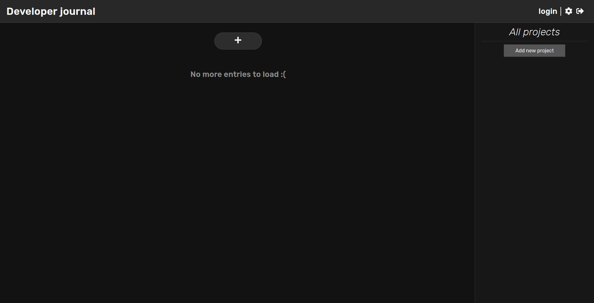
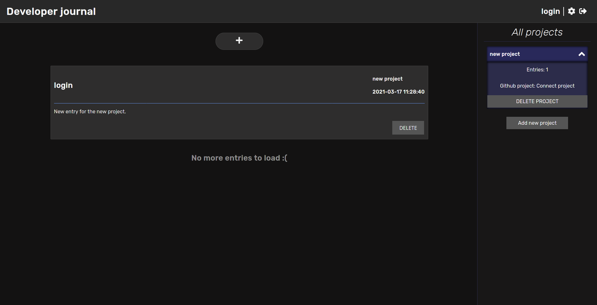
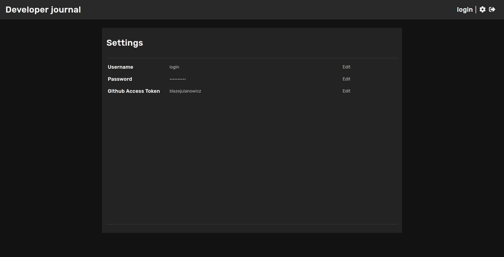

# developer-journal by _blazejulanowicz_

Developer journal, as name suggests, is a utility app - targeted at software developers - that provides a way to 
"extend" 
commits. Git commits are short and descriptive (well, they should be), but you can't fit every interesting 
information into them. This is the basic idea under _developer-journal_, describe a way you've achieved current 
project state, write down some thoughts or any other info you find interesting.
Just a journal entry - from the project perspective!

---

## Overview

Solution was created as a web application that can be running on any system with installed Docker environment.
It can be used in software houses (then one application instance can be used by many developers) or just by 
individuals.

For now, I recommend using web app on desktop environment - mobile use is not currently supported. 

### Current functionalities
  * Create projects - containers of your entries,
  * Write entries - each one described by a timestamp, username and related project,
  * Filter entries by related project - just click on project you want to hide,
  * Change your username and password,
  * Connect your Github account - only generated access token is needed,
  * Connect developer-journal project to Github repository

### Planned functionalities
  * Connect related repository commits with entry - you can see what actions you've described in entry,
  * WakaTime API integration - see overall time spent on project and on every entry-described activity,
  * Sign up form for new users,
  * Markdown support - style your entries,

## Installation and usage

### Prerequisites
  * `docker`,
  * `docker-compose`,
  * min. 3GB of free space
  * no other services running on port 8080 or 3306 (can be changed in `docker-compose.yml` and Spring application 
    properties)
    
### Installation

Clone repository to your machine:
```shell
$ cd <destination-folder>
$ git clone https://github.com/blazejulanowicz/developer-journal.git
$ git cd developer-journal
```

After successfully downloading code just start `docker-compose` (also this two commands is later used for starting 
again Docker containers):
```shell
$ docker-compose up # terminal attached, you can see containers' logs
$ docker-compose up -d # detached version
```

Successful use of above commands should result in two containers - one with the database and one hosting web app.
Web application can be accessed at `localhost:8080` and authenticated by using `login: login, password: password`.
After installation is complete, commands used for rest of the use flow:
```shell
$ docker-compose down # stop your web app
$ docker-compose rm # remove containers and volumes
```

In the case of web app update, just clone repository again and run:
```shell
$ docker-compose up --build
```
This will make sure your data is not lost, and you will be able to use newer version of web app.

## Technology stack

#### Frontend: 
  * React, React Router, React Transition Group, [Rest.js](https://github.com/cujojs/rest), [React FontAwesome]
    (https://fontawesome.com/how-to-use/on-the-web/using-with/react)
  * HTML5, SCSS
  * [Babel](https://github.com/babel/babel), [Webpack](https://github.com/webpack/webpack)

#### Backend:
  * JDK11
  * Spring Boot, Spring Data REST, Spring Security
  * MariaDB
  * Gradle

#### Utilities:
  * Docker
  * docker-compose
  

## Screenshots

---

---

---

---
